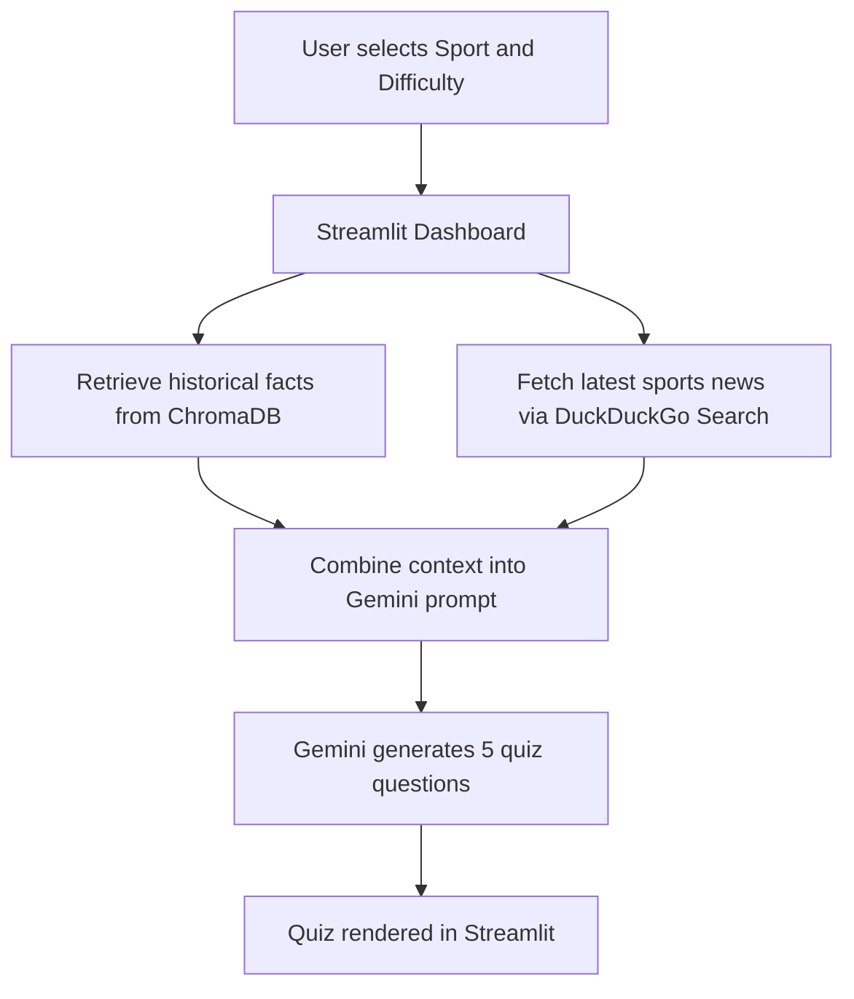

# 🏆 AI-Powered Sports Quiz Generation Agent

## 📌 Project Overview

AI-Powered Sports Quiz Generation Agent is a Python and Streamlit application that generates engaging sports-related multiple-choice quizzes based on a selected sport and difficulty level.

The system uses Retrieval-Augmented Generation (RAG) to improve answer quality and factual accuracy. Historical sports facts are retrieved from ChromaDB, while fresh sports context is gathered using DuckDuckGo Search. Both sources are combined and passed to Google's Gemini model to generate unique quiz questions with answers and short explanations.

## 🎯 Problem Statement

Traditional sports content on social media is often limited to news updates, match highlights, and opinion-based posts. This project introduces a more interactive content format by automatically generating sports quizzes that encourage audience participation and improve engagement.

The goal is to help content creators generate unique, factually grounded quizzes quickly and consistently.

## ✨ Features

- Select a sport
- Select a difficulty level: Easy, Medium, or Hard
- Generate AI-powered sports quizzes
- Regenerate quizzes on demand
- Four answer options per question: A, B, C, and D
- Correct answer with short explanation
- Historical knowledge retrieval using ChromaDB
- Latest sports news retrieval using DuckDuckGo Search
- Gemini-powered quiz generation
- Streamlit-based dashboard
- Retrieval-Augmented Generation (RAG) pipeline

## 🧱 System Architecture

The application follows a simple RAG-based architecture:



## 🛠 Technologies Used

| Category | Technology |
| --- | --- |
| Frontend | Streamlit |
| Backend | Python |
| AI Model | Google Gemini API |
| Vector Database | ChromaDB |
| Web Search | DuckDuckGo Search |
| RAG / Embeddings | sentence-transformers |
| Environment Management | python-dotenv |
| Data Handling | pandas |

## 📁 Project Folder Structure

```text
project/
├── app.py
├── setup_db.py
├── requirements.txt
├── README.md
├── data/
│   └── sports_facts.json
├── chroma_db/
├── src/
│   ├── __init__.py
│   ├── config.py
│   ├── database.py
│   ├── generator.py
│   └── search.py
└── assets/
```

## 🚀 Installation Steps

### 1. Clone the repository

```bash
git clone <your-repository-url>
cd sports-quiz-agent
```

### 2. Create and activate a virtual environment

```bash
python -m venv venv
venv\Scripts\activate
```

### 3. Install dependencies

```bash
pip install -r requirements.txt
```

### 4. Set up the ChromaDB database

Run the one-time setup script to populate the vector database with sports facts:

```bash
python setup_db.py
```

## 🔐 Environment Variables (.env)

Create a `.env` file in the project root and add your API key:

```env
GEMINI_API_KEY=your_api_key
GEMINI_MODEL=gemini-2.5-flash
```

### Notes

- `GEMINI_API_KEY` is required to call the Gemini API.
- `GEMINI_MODEL` can be updated if you want to use a different Gemini model.

## ▶️ How to Run the Project

After installing dependencies and setting up the `.env` file, launch the app with:

```bash
streamlit run app.py
```

If you need to reinstall packages first:

```bash
pip install -r requirements.txt
streamlit run app.py
```

## 🤖 How the AI Agent Works

The quiz generation flow works as follows:

```text
User selects Sport and Difficulty
↓
Historical data retrieved from ChromaDB
↓
Latest sports news retrieved using DuckDuckGo Search
↓
Both contexts are combined into a prompt
↓
Gemini generates 5 unique quiz questions
↓
Questions displayed in the Streamlit dashboard
```

### Workflow Summary

1. The user selects a sport and difficulty level in the Streamlit dashboard.
2. Historical knowledge is retrieved from ChromaDB using sport-specific facts.
3. Recent sports context is gathered from DuckDuckGo Search.
4. Both sources are merged into a prompt for Gemini.
5. Gemini generates five multiple-choice questions with answers and explanations.
6. The result is rendered as a styled quiz in the UI.

## 🧠 Retrieval-Augmented Generation (RAG)

This project uses Retrieval-Augmented Generation to improve factual grounding and reduce hallucinations.

### RAG Components

- **Historical retrieval from ChromaDB**: Retrieves relevant sports facts stored in a persistent vector database.
- **Latest news retrieval**: Uses DuckDuckGo Search to collect recent sports-related context.
- **Context grounding**: Passes retrieved information into the Gemini prompt so the model generates content based on evidence.
- **Reduced hallucinations**: Combining retrieval with generation helps produce more accurate and relevant quiz questions.

## 🖼 Screenshots

Add your screenshots in the `assets/` folder and reference them here.

### Home Page

> Placeholder: Add a screenshot of the home page.

### Quiz Generation

> Placeholder: Add a screenshot of the quiz generation screen.

### Generated Quiz

> Placeholder: Add a screenshot of the final generated quiz.

## 🔮 Future Improvements

- Add more sports categories
- Export quiz as PDF
- Add user authentication
- Store quiz history
- Add more difficulty customization
- Add score tracking and analytics
- Support more vector databases
- Add quiz sharing for social media platforms

## 👤 Author

**Name:** Sudarshan D

**Role:** MCA Student | AI & Machine Learning Enthusiast

**GitHub:** Add placeholder

**LinkedIn:** Add placeholder


---

If you want to improve this submission further, consider adding real screenshots, a short demo GIF, and a live deployment link.
